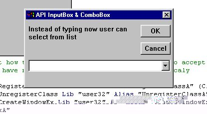



## API InputBox & Combo Box

### Description

Normaly input box has a text box, this one have a combo box. I found it very useful for use in MS access - It spares tons of forms. Anyway you could learn a lot about API creating windows from this.I think this is a must have for any programmer under sun.
 
### More Info
 

             |
---                |---
**Submitted On**   |2002-03-05 06:46:18
**By**             |[M\.C](https://github.com/Planet-Source-Code/PSCIndex/blob/master/ByAuthor/m-c.md)
**Level**          |Advanced
**User Rating**    |5.0 (25 globes from 5 users)
**Compatibility**  |VB 6\.0
**Category**       |[Complete Applications](https://github.com/Planet-Source-Code/PSCIndex/blob/master/ByCategory/complete-applications__1-27.md)
**World**          |[Visual Basic](https://github.com/Planet-Source-Code/PSCIndex/blob/master/ByWorld/visual-basic.md)
**Archive File**   |[API\_InputB60350382002\.zip](https://github.com/Planet-Source-Code/m-c-api-inputbox-combo-box__1-32449/archive/master.zip)

